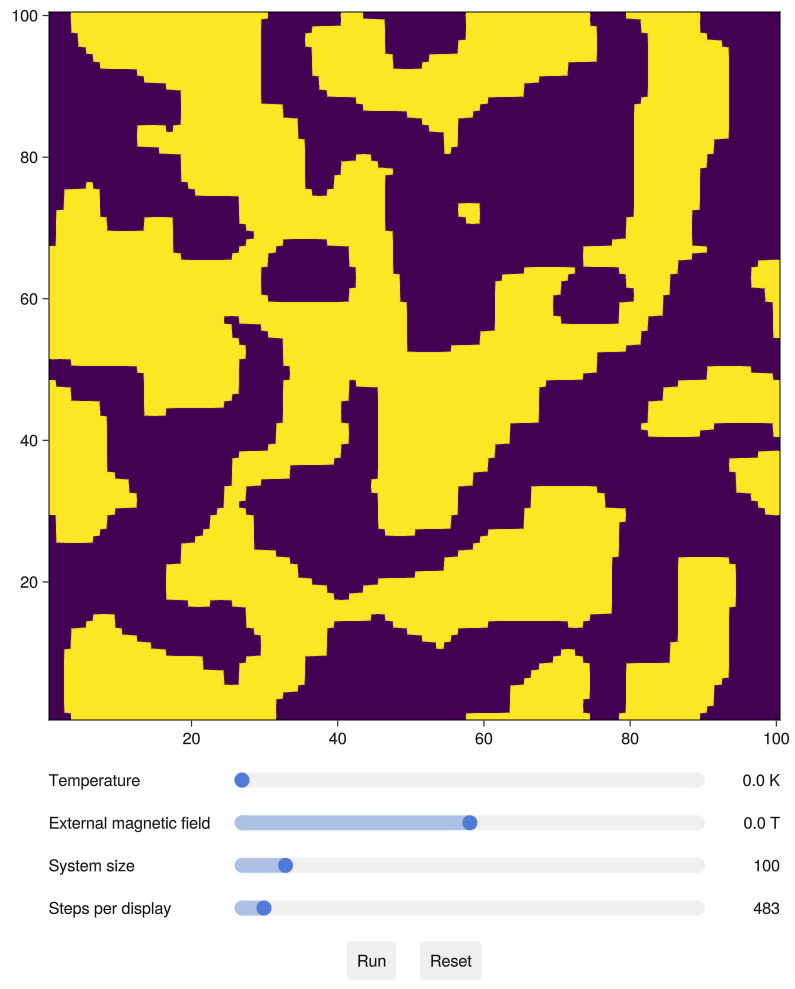

# Interactive Ising Model

_Made with [Julia](https://julialang.org) and [Makie](https://makie.org)_



## How to use

After installing packages, the app can be launched by running the `start` file.

Startup can be slow due to first-time compilation, so a convenience script `precompile` is included which generates a system image for the application. Subsequent runs can be sped up by specifying `ising.so` as the Julia system image.

```
julia --project=. --sysimage=ising.so ising.jl
```
